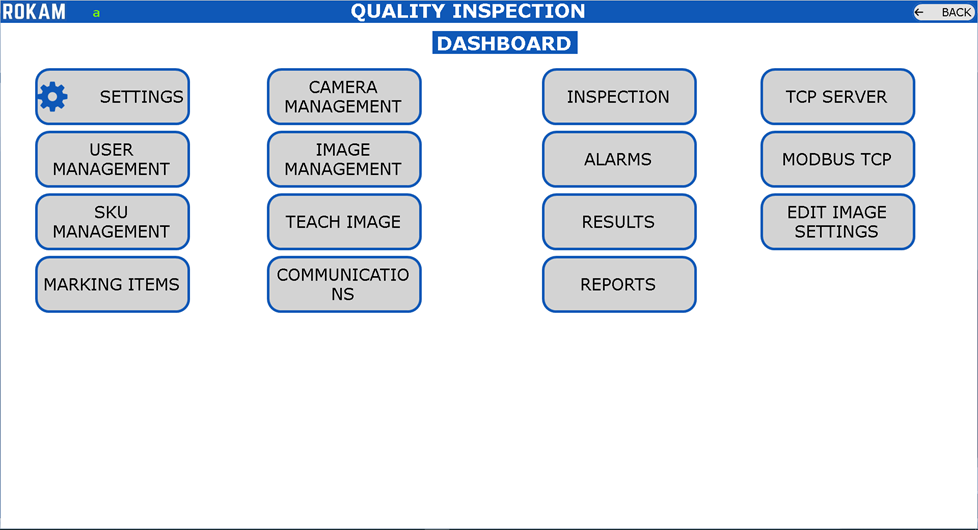
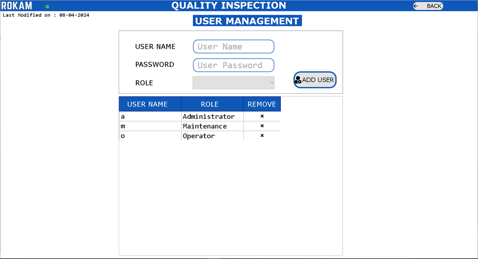
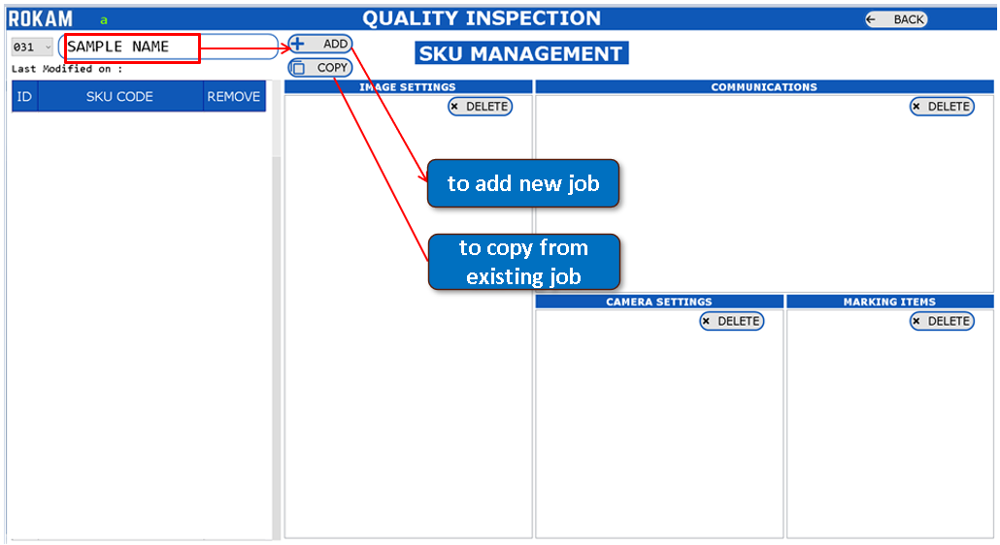
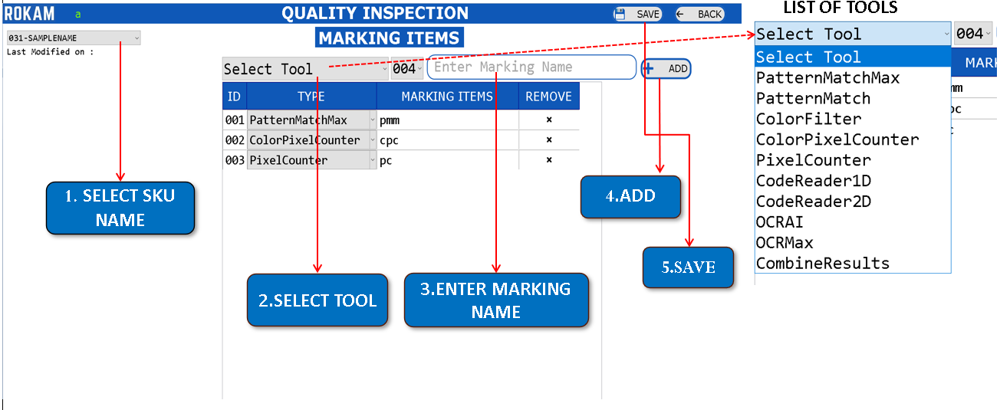
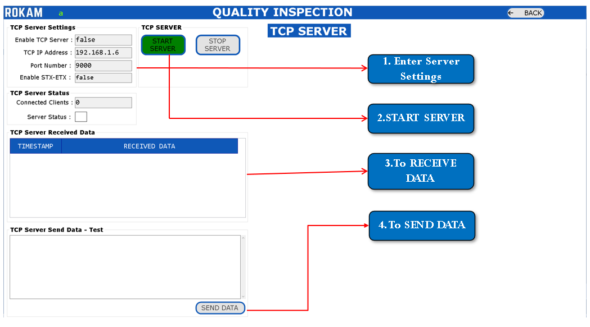
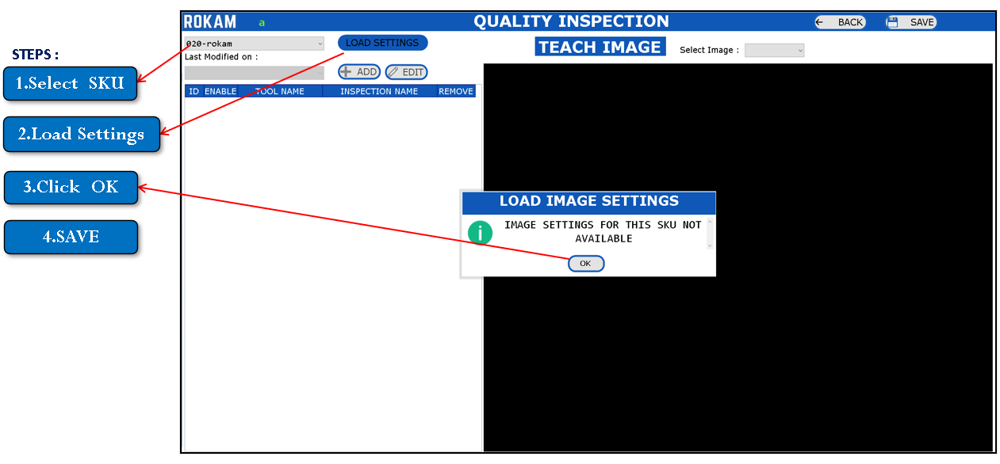
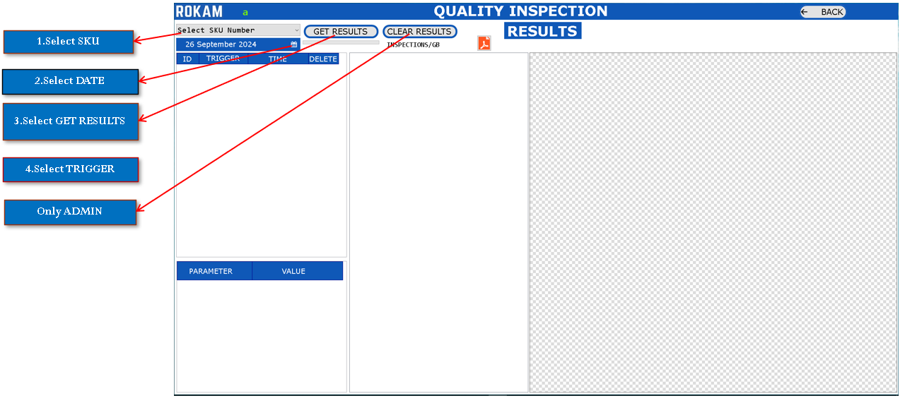

# QUALITY INSPECTION

## **INTRODUCTION**

Our application specialize in advanced automation technologies such as surface detect inspection, OCR/OCV (Optical Character Recognition/Optical Character Verification), and critical measurements. These technologies are integrated into our specialized application, **QualityInspection**, which is designed to enhance precision and operational efficiency in various industrial processes.

## **QUALITY INSPECTION** DASHBOARD

## **USER MANAGEMENT**

## **SKU MANAGEMENT**   

## **MARKING ITEMS**

## **CAMERA MANAGEMENT** 

## **IMAGE MANAGEMENT**

## **COMMUNICATIONS**  

### **COMMUNICATIONS**  PART 01

### **COMMUNICATIONS**  PART 02

### **COMMUNICATIONS**  PART 03

## **TEACH IMAGE**

### **TEACH IMAGE** PART 01

## **INSPECTION**

## **RESULTS**

## **REPORTS**

## **ALARMS**

